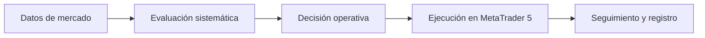

# Contexto público de Blue Boost Bot

> Referencia interna para el proyecto web de Investors Logics. Este documento contiene únicamente información general y publicable. Los detalles de estrategia, ejecución y optimización son confidenciales y no deben inferirse, reproducirse ni mostrarse en el sitio.

## Qué es

Blue Boost Bot es un **Expert Advisor para MetaTrader 5** desarrollado por Investors Logics. Automatiza la evaluación del mercado y la gestión de operaciones de acuerdo con reglas sistemáticas definidas por el equipo.

Está orientado al mercado Forex y puede trabajar con varios instrumentos compatibles con la cuenta y el broker configurados.

## Propósito

El sistema busca convertir un proceso de trading definido en una operación automatizada, consistente y verificable dentro de MetaTrader 5.

Sus responsabilidades generales son:

- evaluar periódicamente las condiciones del mercado;
- aplicar criterios sistemáticos de entrada y gestión;
- enviar y administrar operaciones mediante MetaTrader 5;
- adaptarse a la nomenclatura de instrumentos del broker;
- registrar información técnica para pruebas y evaluación interna;
- permitir la activación o desactivación controlada de componentes operativos.

## Características públicas

- Automatización mediante un Expert Advisor de MetaTrader 5.
- Operación sobre múltiples instrumentos Forex.
- Proceso basado en reglas y condiciones de mercado predefinidas.
- Configuración de ejecución desde MetaTrader 5.
- Compatibilidad con variaciones de nombres de instrumentos entre brokers.
- Herramientas internas para backtesting y análisis técnico de resultados.
- Registro de métricas operativas y de riesgo para evaluación interna.

## Descripción funcional de alto nivel

Este flujo es deliberadamente general. Los cálculos, filtros, parámetros y reglas que implementan cada etapa son propiedad intelectual privada.

## Naturaleza tecnológica

El componente inspeccionado es software MQL5 ejecutado dentro de MetaTrader 5. Su comportamiento se basa en lógica programada y determinista.

No se debe presentar Blue Boost Bot como un producto de inteligencia artificial o machine learning sin evidencia verificable de un componente adicional que utilice esas tecnologías.

## Backtesting y evaluación

El sistema incluye instrumentación para evaluar su comportamiento en el Strategy Tester de MetaTrader 5. Esta capacidad permite estudiar resultados, actividad y exposición antes de tomar decisiones internas.

La existencia de herramientas de backtesting no demuestra rentabilidad futura. Ninguna métrica, periodo, configuración o resultado privado debe publicarse sin autorización expresa y evidencia revisada.

## Riesgos

Blue Boost Bot opera en mercados apalancados. El trading de divisas puede causar pérdidas parciales o totales y no es adecuado para todas las personas.

La comunicación pública debe dejar claro que:

- la automatización no elimina el riesgo;
- los resultados pasados no garantizan resultados futuros;
- las condiciones del mercado y del broker pueden afectar la ejecución;
- el usuario debe evaluar su experiencia, situación financiera y tolerancia al riesgo;
- no debe utilizar capital que no pueda permitirse perder.

## Límite de confidencialidad

### Información permitida en la web

- nombre y categoría general del producto;
- plataforma de ejecución: MetaTrader 5;
- orientación general a Forex;
- automatización basada en reglas;
- capacidad multi-instrumento;
- existencia de pruebas y observabilidad internas;
- advertencias de riesgo y limitaciones;
- información comercial aprobada directamente por Investors Logics.

### Información privada que no debe publicarse

- fórmulas, indicadores, filtros o condiciones de entrada y salida;
- temporalidades, ventanas de cálculo o valores límite;
- instrumentos o universos concretos de operación;
- estructura interna de estrategias o variantes;
- parámetros de ejecución, identificadores técnicos o frecuencias;
- reglas de gestión de posiciones y exposición;
- tamaños, secuencias o escalado de operaciones;
- objetivos, distancias, límites o mecanismos de cierre;
- código, nombres internos de funciones y organización de módulos;
- metodología, candidatos e historial de optimización;
- configuraciones del Strategy Tester;
- resultados, métricas o archivos de backtest no autorizados;
- rutas locales, credenciales o contenido de archivos `.env`;
- cualquier dato que permita reconstruir o aproximar la estrategia.

## Mensajes recomendados para el sitio

### Descripción breve

> Blue Boost Bot es un sistema automatizado para MetaTrader 5 que aplica un proceso de trading sistemático sobre el mercado Forex.

### Descripción ampliada

> Desarrollado por Investors Logics, Blue Boost Bot convierte criterios de mercado definidos en un flujo automatizado de evaluación, ejecución y seguimiento dentro de MetaTrader 5. El sistema está diseñado para trabajar con múltiples instrumentos y cuenta con herramientas internas de prueba y observabilidad.

### Mensaje de producto

> Automatización disciplinada para procesos de trading definidos.

Estas frases describen capacidades observables sin revelar la estrategia ni prometer resultados.

## Afirmaciones que requieren aprobación y evidencia

No publicar sin respaldo verificable:

- rentabilidad, retorno o tasa de éxito;
- reducción garantizada del riesgo o drawdown;
- resultados de cuentas reales;
- cifras de usuarios, capital o volumen gestionado;
- compatibilidad universal con cualquier broker;
- superioridad frente a otros sistemas;
- certificaciones, regulación o auditorías externas;
- disponibilidad continua o ausencia de errores;
- uso de inteligencia artificial;
- testimonios o resultados no documentados.

## Reglas para este proyecto web

1. Usar este archivo como límite de información pública, no como documentación técnica.
2. Tratar el código y los documentos del repositorio de Blue Boost Bot como confidenciales.
3. No copiar al sitio nombres internos, parámetros, tablas, fragmentos de código ni resultados.
4. No inspeccionar ni reproducir secretos de configuración.
5. Consultar al usuario antes de ampliar cualquier detalle técnico del producto.
6. Separar siempre capacidad técnica de rendimiento financiero.
7. Mantener advertencias visibles sobre trading apalancado.
8. Si una afirmación no aparece en esta sección pública o no fue aprobada por el usuario, no publicarla.

## Procedencia

Este contexto se preparó el 13 de agosto de 2026 mediante una inspección de solo lectura del sistema. No se modificó el repositorio de Blue Boost Bot y no se leyó su archivo `.env`.
